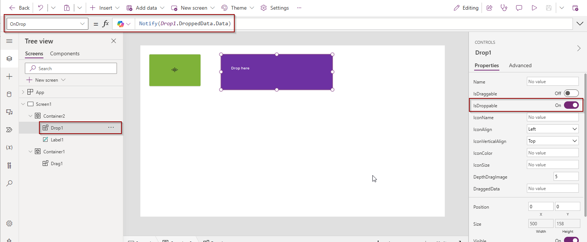

# Drag & Drop PCF

This is a code component for Power Apps (PCF). Is intended to offer a free-style drag&drop possibility.
It's not a container for other UI elemenets, but an empty-DIV which we can place over other containers. 
It can be used as:
 - a drag component: by placing it over a container, we can mimic the drag-behaviour of that container, together with the contained elements
 - a drop component: by placing it over a container, it can be the target of drag&drop actions.
 

It can be used transparent, over your container. Or you can show an icon from Fluent UI 8 library inside that div. Probably the most comon use-case for the icon, is to show that this area is draggable.

**It's important to bring the Drag&Drop PCF on the top of your container**

This PCF is intended to be used inside Canvas Apps or Custom Pages, but in my tests worked even inside model-driven forms.

You can use it as both a source and a target of a drag&drop action, but you can use it also in combination with your own PCF.
For instance: to drag an item from a gallery over a specific position inside your own PCF.

**Please be aware that the drag&drop doesn't work inside the maker portal. But it does work inside the App!**

 ## Parameters and customizing

 - **Name** (Optional) : the name can be used to classify the Drag&Drop components on your Canvas. It will allow to drop only over Drop&Drop components with the same name.For instance you have a group of draggable components, with the Name "leftSide", and another group named "rightSide". The user will get the visial feedback that they can drop elements from "leftSide" only over "leftSide" containers.
 - **isDraggable** : this PCF instance is used to show a drag action
 - **isDroppable** : this PCF instance is used as a drop target
 - **DraggedData** : id the PCF isDraggable= true, we can define here the data which will be dragged
 - **IconName** - the name of the icon. You can find the icon in the list of icons from Fluent UI 8. For instance **DragObject**. You can find more icons (here)[https://developer.microsoft.com/en-us/fluentui#/styles/web/icons]
 - **IconAlign** - Where to place the icon. You can choose from "Left", "Center", "Right"
 - **IconVerticalAlign** - Vertical alignment if the icon, inside the containing DIV. You can choose from "Top", "Center", "Bottom"
 - **IconColor** - a string representing the color of the icon
 - **IconSize** - css fontSize property
 - **DepthDragImage** - This PCF is placed over a container, to mimic the drag&drop of the underlying container your choose. During the drag&drop you want the user to see what exactly they are dragging. This parameter allows you to specify how deep to look for the parentElement in order to show the image being dragged. It has nothing to do withe drag data being dragged, is only about the image shown during the drag&drop action. It will make a screenshot of that parentElement. I've made good tests with DepthDragImage = "5" or "6" (but depends on your intent).

 - **OnDrop** event -  If you are using the PCF as a drop target, you get an **OnDrop** event. 

 - **DroppedData** -  For the "isDroppable" components, inside the OnDrop event, you can use the **DroppedData** to read the data being dropped. This is a JSON object with the following subproperties
    - Data - the property specified for "DraggedData" for the source PCF being dragged
    - X : the X coordinate for the drop action (relative to the PCF placement)
    - Y : the Y coordinate for the drop action (relative to the PCF placement)

## Example

Let's consider a Canvas App, where we place the PCF twice: once as a drag area, once as a drop area.
We would have for drag component:


And the Drop1 as a drop component


Here the complete yaml


After we save and publish the app, close the designer and run the app, we can drag the red area over the drop area (which is not visible in the demo.. but we could place some other elements below it).


 ## Drop over your own PCF

 To be able to drop this PCF oevr your own PCF, implement the following inside your own PCF:
 1. Define a HTML element, and register the onDrop and onDrgaOver events
 ```html
 <div className="rbc-event-content" onDrop={onDrop} onDragOver={allowDrop} ></div>
 ```
 2. Implement the onDragOver by calling preventDefault. That means that the brower will ignore the drop default behaviour, and allow you to implement your own
 ```javascript
 const allowDrop= (ev: React.DragEvent<HTMLDivElement>) => {    
    ev.preventDefault();    
  }
 ```
 3. Implement the onDrop event
 ```javascript
 const dropName = ""; //drag&drop name here
 const onDrop = (ev: React.DragEvent<HTMLDivElement>) => {
    ev.preventDefault();
    const data = ev.dataTransfer.getData(`Dianamics.DragAndDrop.${dropName}`);
    //data is the data dragged from outside your PCF
  }
 ```


 ## Limitations

 - We can mimic the drag&drop only by placing this PCF over a container. The container can be a Canvas App Container, or the elements of a Gallery.
 - The drag&drop action doesn't work inside the maker portal
 - The drag&drop PCF must be placed on top of the other controls inside your container
 - ... tbd
